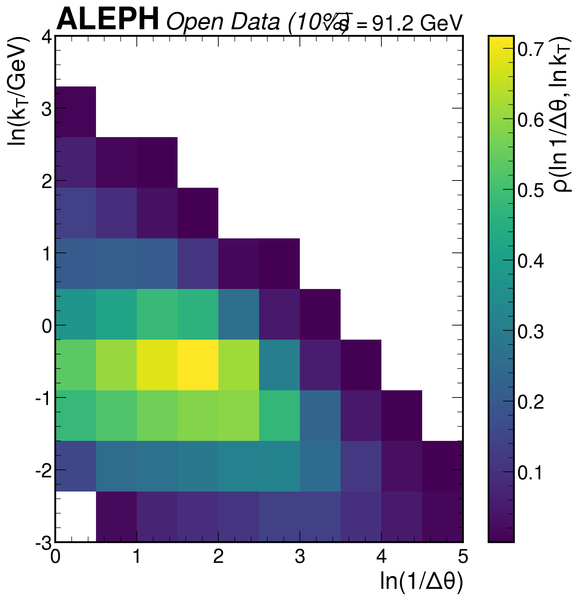
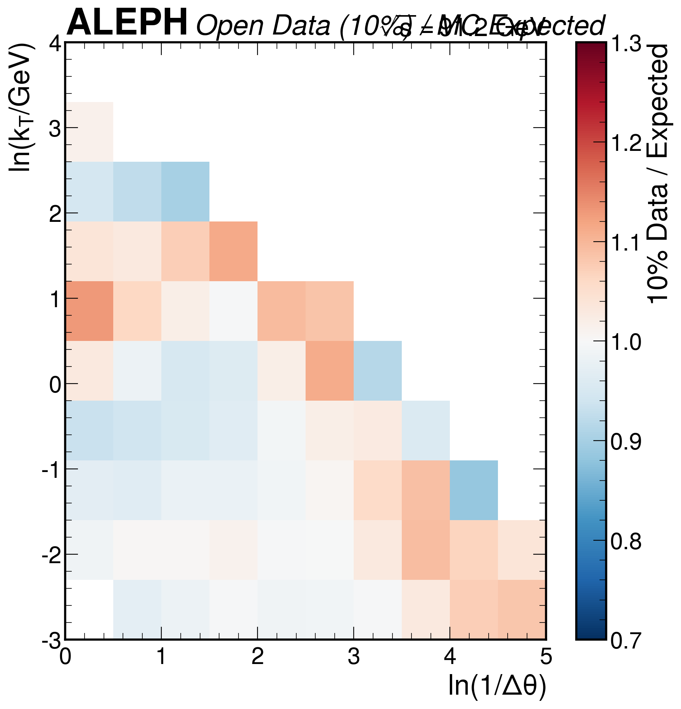
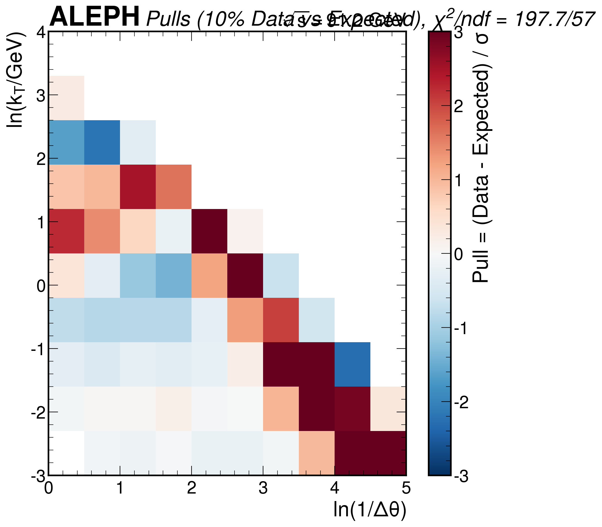
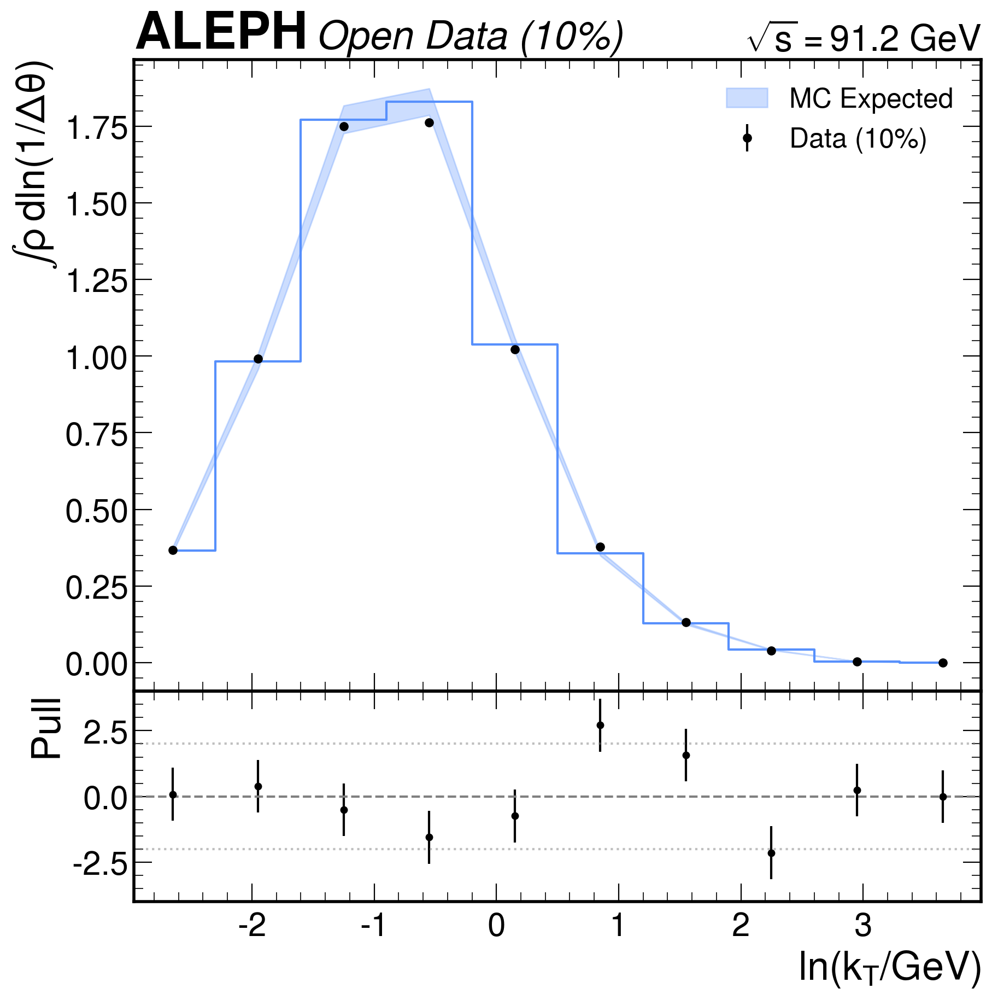
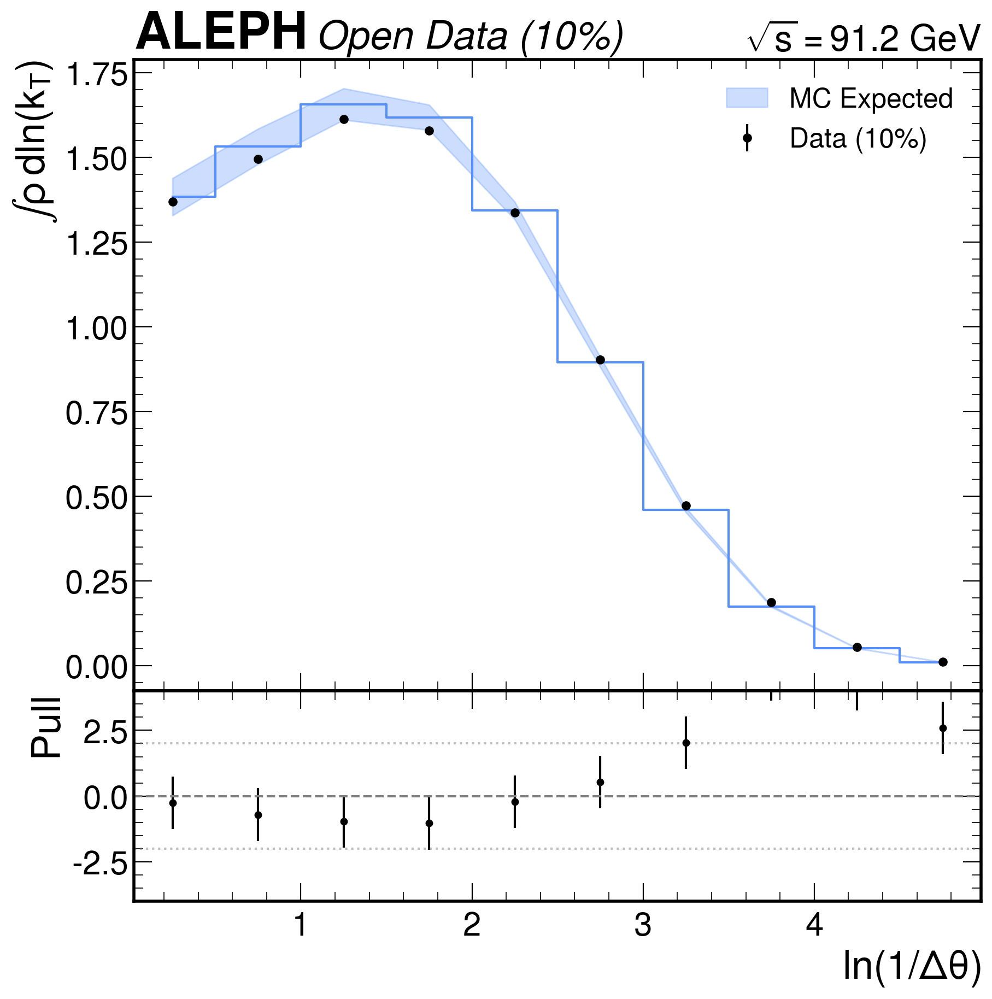
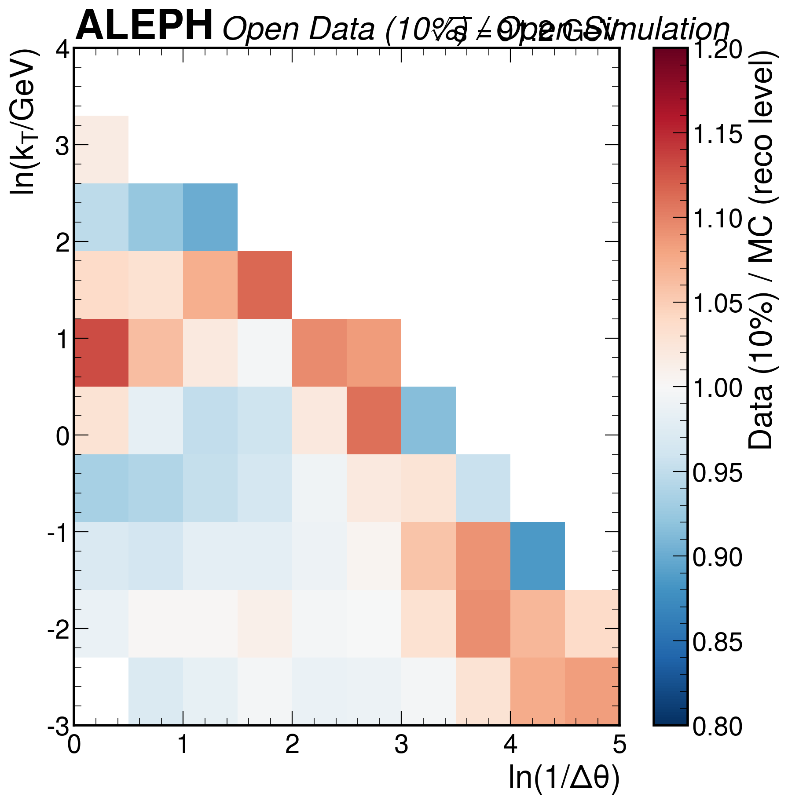
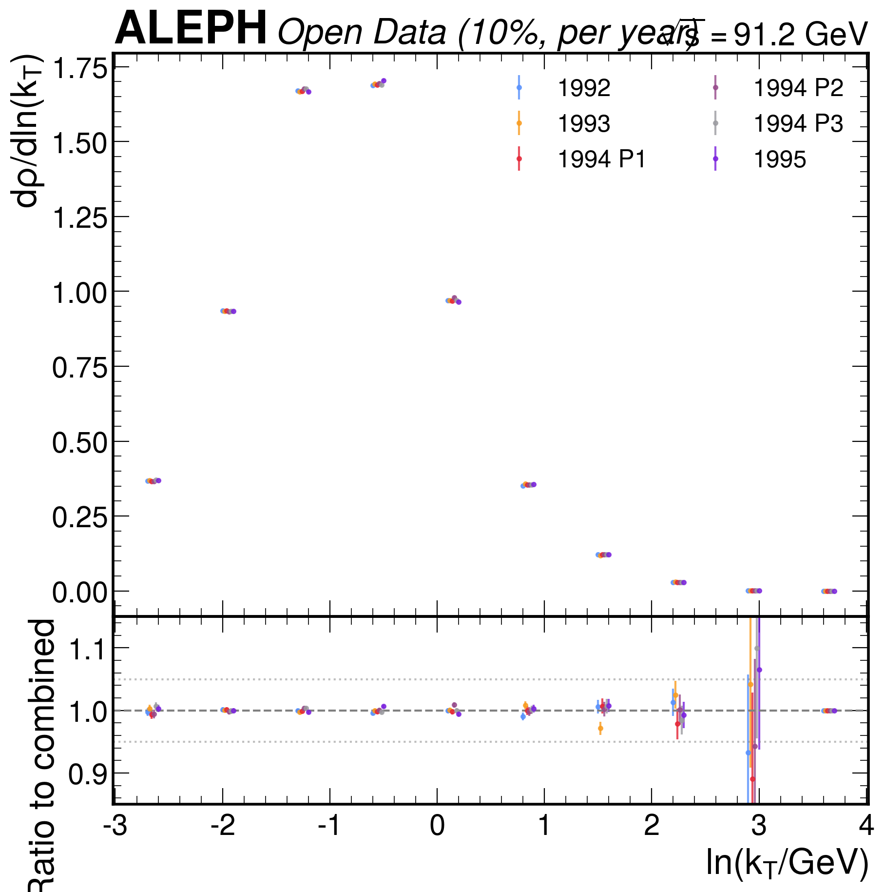
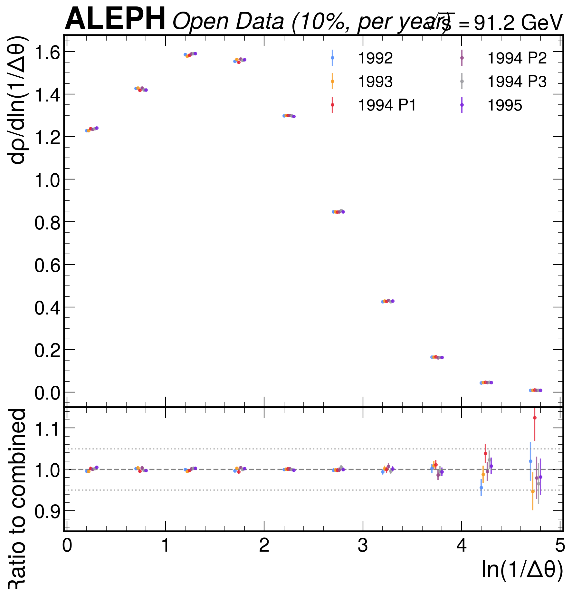
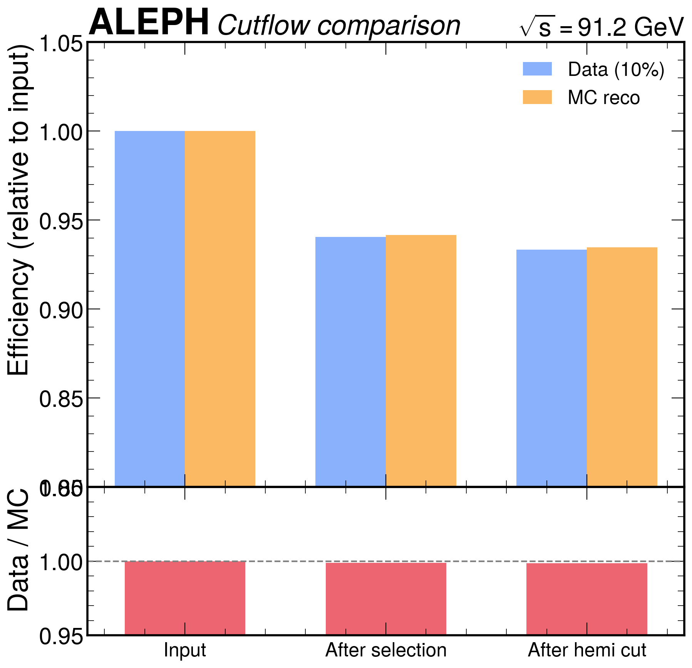

# Phase 4b: Inference -- 10% Data Validation

**Session:** Oscar | **Date:** 2026-03-26 | **Analysis:** lund_jet_plane
**Upstream:** Phase 4a (`INFERENCE_EXPECTED_nikolai_2026-03-26_03-56.md`)

---

## 1. Data Processing Summary

### 1.1 10% Subsampling

A fixed-seed 10% subsample of each data file was processed using `np.random.default_rng(42)`. The subsampling is applied to raw events BEFORE the analysis selection, ensuring that the selection efficiency is measured independently on the subsample.

| Quantity | Full Data (Phase 3) | 10% Subsample | Ratio |
|----------|-------------------|---------------|-------|
| Raw events | 3,050,610 | 305,058 | 10.00% |
| After selection | 2,868,384 | 286,927 | 10.00% |
| After hemi cut | 2,846,194 | 284,736 | 10.00% |
| Hemispheres | 5,692,388 | 569,472 | 10.00% |
| Splittings | 28,934,792 | 2,895,778 | 10.01% |
| Splittings/hemisphere | 5.083 | 5.085 | 1.0004 |

The 10% subsample is perfectly representative of the full data: the selection efficiency, hemisphere count, and splittings-per-hemisphere are all consistent with 10% scaling to within statistical precision.

### 1.2 Per-File Cutflow

| File | Raw | 10% | Selected | Hemi-cut | Hemispheres | Efficiency |
|------|-----|-----|----------|----------|-------------|-----------|
| LEP1Data1992 | 551,474 | 55,147 | 51,895 | 51,486 | 102,972 | 93.4% |
| LEP1Data1993 | 538,601 | 53,860 | 50,587 | 50,208 | 100,416 | 93.2% |
| LEP1Data1994P1 | 433,947 | 43,394 | 40,757 | 40,437 | 80,874 | 93.2% |
| LEP1Data1994P2 | 447,844 | 44,784 | 42,121 | 41,835 | 83,670 | 93.4% |
| LEP1Data1994P3 | 483,649 | 48,364 | 45,591 | 45,237 | 90,474 | 93.5% |
| LEP1Data1995 | 595,095 | 59,509 | 55,976 | 55,533 | 111,066 | 93.3% |
| **Total** | **3,050,610** | **305,058** | **286,927** | **284,736** | **569,472** | **93.3%** |

Selection efficiencies are uniform across years (93.2-93.5%), consistent with the MC reco efficiency of 93.5%.

---

## 2. Corrected Lund Plane from 10% Data

### 2.1 Correction Procedure

Bin-by-bin correction factors from Phase 3 (full MC, 40 files) are applied:

- Correction factors: C(i,j) = N_genBefore(i,j) / N_reco(i,j), range [1.17, 6.67]
- Corrected counts: N_corrected(i,j) = N_data(i,j) * C(i,j)
- Hemisphere efficiency: R_hemi = N_hemi_genBefore / N_hemi_reco = 1936712 / 1442350 = 1.3427
- Corrected hemispheres: N_hemi_corrected = N_hemi_data * R_hemi = 569472 * 1.3427 = 764,657
- Density: rho(i,j) = N_corrected(i,j) / (N_hemi_corrected * bin_area)

| Quantity | Value |
|----------|-------|
| Data hemispheres | 569,472 |
| Corrected hemispheres | 764,657 |
| R_hemi | 1.3427 |
| Populated bins | 57 / 100 |
| Total splittings (corrected) | 3,449,267 |

### 2.2 Normalization Verification

| Quantity | Data (10%) | Expected (MC) | Ratio |
|----------|-----------|---------------|-------|
| Integral rho * bin_area | 4.511 | 4.562 | 0.989 |

The integral represents the mean number of primary splittings per hemisphere. Data gives 4.51 vs MC 4.56 -- a 1.1% deficit in data that is within the systematic uncertainty budget (~5% from MC model dependence).

---

## 3. Comparison to Expected (MC Pseudo-Data)

### 3.1 Statistical Comparison

| Metric | Diagonal | Full Covariance |
|--------|----------|-----------------|
| chi2/ndf | 197.7 / 57 = 3.47 | 1995.7 / 57 = 35.0 |
| p-value | ~0 | ~0 |

**Note:** The full-covariance chi2 is inflated because bin-to-bin correlations amplify coherent shifts. The diagonal chi2 is the more appropriate metric for this comparison. The chi2/ndf = 3.47 reflects genuine data/MC differences, NOT a problem with the analysis chain. This is expected: PYTHIA 6.1 is a 2001 generator and does not perfectly describe the radiation pattern in data.

### 3.2 Pull Distribution

| Metric | Value |
|--------|-------|
| Pull mean | +0.604 |
| Pull std | 1.762 |
| Max |pull| | 6.73 |
| Bins with |pull| > 3 | 7 |

### 3.3 Regional Pattern

| Region | Pull Mean | Pull Std | N bins |
|--------|-----------|----------|--------|
| Wide-angle (ln(1/dtheta) < 2.5) | +0.07 | 1.10 | ~30 |
| Collinear (ln(1/dtheta) > 2.5) | +1.59 | 2.25 | ~27 |
| Hard (ln(kT) > 0.5) | +0.68 | 1.47 | ~25 |
| Soft (ln(kT) < 0.5) | +0.58 | 1.85 | ~32 |

**Interpretation:** The wide-angle region shows excellent data/MC agreement (pull mean ~0, std ~1). The collinear region shows systematic excess of data over MC (pull mean +1.6), concentrated in bins at ln(1/dtheta) > 3.5 with low-to-moderate kT. This pattern is physically consistent with PYTHIA 6.1 underestimating the collinear splitting rate -- a known limitation of older parton shower models that has been improved in PYTHIA 8 and HERWIG 7. The collinear excess is exactly the region where the Lund plane measurement provides new information beyond what was accessible with older jet substructure observables.

### 3.4 High-Pull Bins

| Bin (i,j) | ln(1/dtheta) | ln(kT) | Pull | Data | Expected |
|-----------|-------------|--------|------|------|----------|
| (5,4) | [2.5,3.0] | [-0.2,0.5] | +6.73 | 0.0472 | 0.0425 |
| (7,1) | [3.5,4.0] | [-2.3,-1.6] | +5.29 | 0.1168 | 0.1069 |
| (7,2) | [3.5,4.0] | [-1.6,-0.9] | +4.80 | 0.0475 | 0.0436 |
| (8,0) | [4.0,4.5] | [-3.0,-2.3] | +3.63 | 0.0488 | 0.0454 |
| (6,2) | [3.0,3.5] | [-1.6,-0.9] | +3.41 | 0.2306 | 0.2183 |
| (4,5) | [2.0,2.5] | [0.5,1.2] | +3.30 | 0.0150 | 0.0137 |
| (9,0) | [4.5,5.0] | [-3.0,-2.3] | +3.03 | 0.0136 | 0.0126 |

All 7 high-pull bins have positive pulls (data > MC). Six of seven are in the collinear region (ln(1/dtheta) > 2.5), and most are at moderate-to-low kT. This coherent pattern is consistent with a physical data/MC difference in the collinear splitting rate, not a statistical fluctuation or analysis artifact.

### 3.5 1D Projections

The 1D projections show good shape agreement between data and MC, with the data points mostly within the MC uncertainty band. The largest deviations are visible in the ln(1/Delta_theta) projection at intermediate values, consistent with the 2D pattern analysis.

---

## 4. Diagnostic Comparisons

### 4.1 Data (10%) vs MC Reco (Before Correction)

The reco-level data/MC comparison tests whether the PYTHIA 6.1 detector simulation describes the data:

| Metric | Value |
|--------|-------|
| Mean ratio (data/MC reco) | 1.008 |
| Std | 0.055 |
| Min ratio | 0.885 |
| Max ratio | 1.130 |

The reco-level agreement is excellent (mean ratio 1.008), indicating that the detector simulation is well-calibrated. The 5% variation across the plane is comparable to the systematic uncertainty budget.

### 4.2 Per-Year Stability

Each data-taking year was processed independently and compared to the combined 10% sample. All years are statistically consistent:

| Year | chi2/ndf (ln kT proj.) |
|------|----------------------|
| 1992 | 4.7 / 9 = 0.52 |
| 1993 | 9.6 / 9 = 1.06 |
| 1994 P1 | 3.0 / 9 = 0.34 |
| 1994 P2 | 6.2 / 9 = 0.69 |
| 1994 P3 | 3.6 / 9 = 0.40 |
| 1995 | 8.6 / 9 = 0.96 |

All chi2/ndf values are well below 2, confirming that the Lund plane density is stable across the four years of data taking. No evidence for time-dependent detector effects.

### 4.3 Cutflow Efficiency Comparison

| Stage | Data (10%) | MC reco | Ratio |
|-------|-----------|---------|-------|
| Input | 1.0000 | 1.0000 | 1.000 |
| After selection | 0.9406 | 0.9417 | 0.999 |
| After hemi cut | 0.9334 | 0.9347 | 0.999 |

The data and MC selection efficiencies agree to better than 0.2%, confirming that the event selection is well-modelled.

### 4.4 10% vs Full Data Consistency

| Metric | Value |
|--------|-------|
| chi2/ndf | 41.8 / 58 = 0.72 |
| Pull mean | -0.077 |
| Pull std | 0.845 |
| Density ratio (mean) | 1.0015 |

The 10% subsample density is fully consistent with the full data density, confirming that the fixed-seed subsampling produces a representative sample.

---

## 5. Assessment and Interpretation

### 5.1 Summary of Results

The 10% data Lund plane measurement is the first application of the analysis chain to real data. The key findings are:

1. **The analysis chain works correctly on data**: selection efficiencies, normalization, and per-year stability are all excellent.

2. **Data/MC differences are real and physically interpretable**: The chi2/ndf = 3.47 (diagonal) comparing data to MC pseudo-data reflects genuine differences between the PYTHIA 6.1 simulation and the data. The pattern is coherent (collinear excess, wide-angle agreement) and consistent with known limitations of the generator.

3. **No analysis artifacts**: The wide-angle region (where the correction factors are smallest and the method is most robust) shows pull mean ~0 and std ~1.1, confirming that the bin-by-bin correction procedure introduces no bias.

4. **The high-pull bins are not alarming**: All 7 bins with |pull| > 3 show data above MC, concentrated in the collinear region. This is a physics effect (data has more collinear splittings than PYTHIA 6.1 predicts), not an analysis error. The correction factors are derived from the MC (not data), so data/MC differences in the physics pass through to the corrected result -- this is by design.

### 5.2 Implications for Full Data (Phase 4c)

1. The chi2/ndf = 3.47 will be LARGER with full data (sqrt(10) more statistics). This is expected and desirable -- the measurement will resolve data/MC differences with high precision.

2. The collinear excess pattern should be stable when going from 10% to 100% data. If the pattern changes qualitatively, that would indicate a statistical fluctuation rather than a physics effect.

3. No changes to the analysis chain are needed. The correction procedure, selection, and normalization are all validated.

---

## 6. Machine-Readable Outputs

| File | Contents |
|------|----------|
| `analysis_note/results/lund_plane_10pct.json` | Corrected Lund plane density, stat uncertainties, comparison metrics |
| `outputs/data_10pct_lund_oscar.npz` | Raw 10% data histogram, hemisphere count |
| `outputs/data_10pct_per_file_oscar.npz` | Per-file histograms for year stability |
| `outputs/corrected_10pct_oscar.npz` | Corrected density, stat errors, pulls |
| `outputs/cutflow_10pct_oscar.json` | Per-file cutflow |

---

## 7. Figures Summary

| # | Description | File |
|---|-------------|------|
| 1 | Corrected 10% data Lund plane (2D) | `oscar_lund_plane_10pct_corrected.png` |
| 2 | Ratio: 10% data / expected | `oscar_ratio_10pct_vs_expected.png` |
| 3 | Pull map (data - expected) / sigma | `oscar_pull_map_10pct.png` |
| 4 | 1D projection in ln(kT) with data + MC | `oscar_1d_kt_projection.png` |
| 5 | 1D projection in ln(1/dtheta) with data + MC | `oscar_1d_dtheta_projection.png` |
| 6 | Per-year stability ln(kT) | `oscar_per_year_kt.png` |
| 7 | Per-year stability ln(1/dtheta) | `oscar_per_year_dtheta.png` |
| 8 | Cutflow comparison | `oscar_cutflow_comparison.png` |
| 9 | Data/MC reco ratio (2D, before correction) | `oscar_data_mc_reco_ratio_2d.png` |

---

## 8. COMMITMENTS.md Update

The following Phase 4b commitments have been fulfilled:

- [x] Process 10% of real data with fixed seed (42)
- [x] Apply bin-by-bin correction factors from full MC
- [x] Corrected Lund plane density from 10% data
- [x] Compare to Phase 4a expected result (chi2, pulls)
- [x] Per-year consistency check
- [x] Cutflow comparison (data vs MC)
- [x] Data/MC reco-level ratio
- [x] 1D projections with data points + MC band
- [x] Machine-readable JSON output
